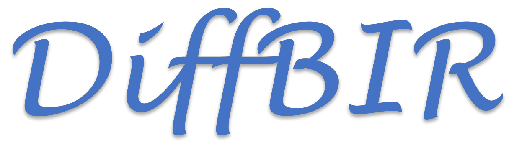
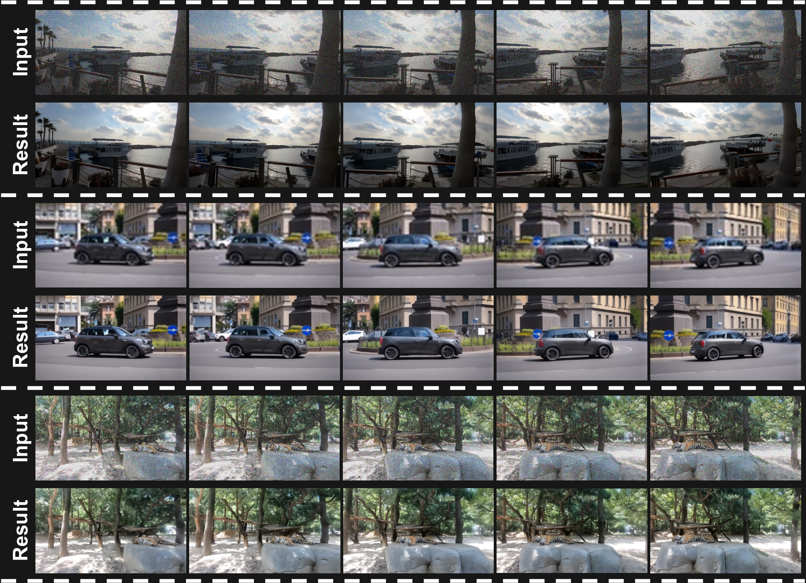
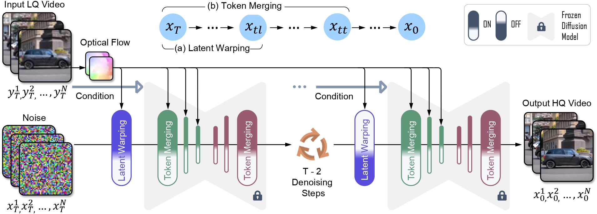
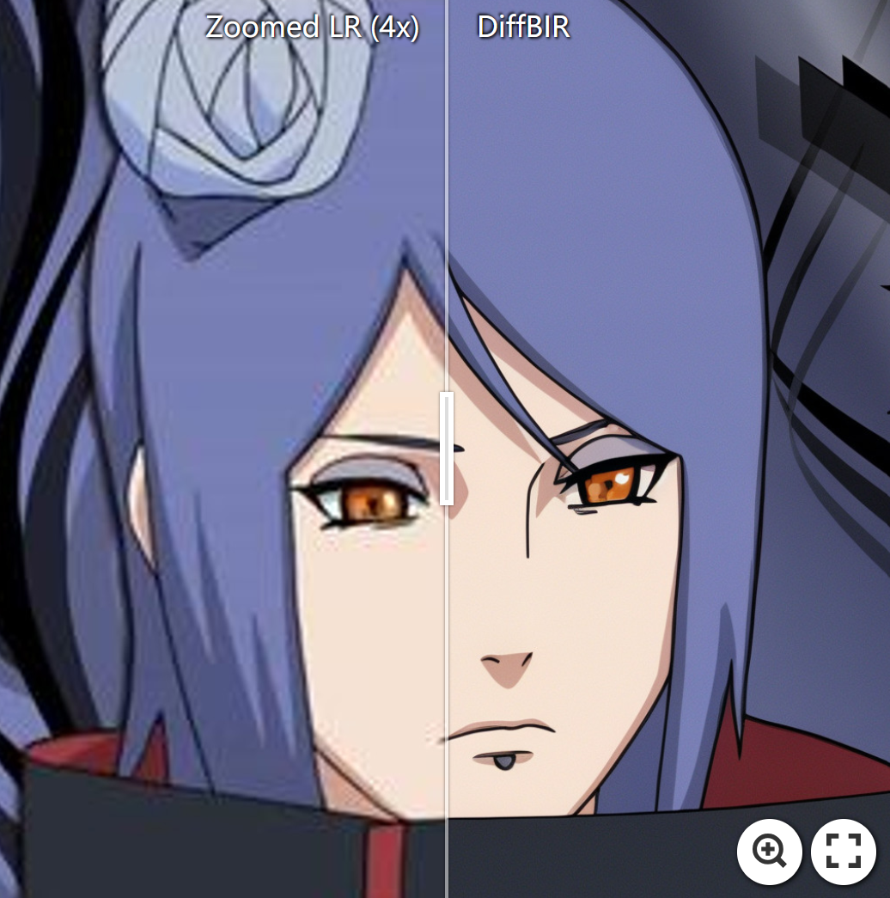
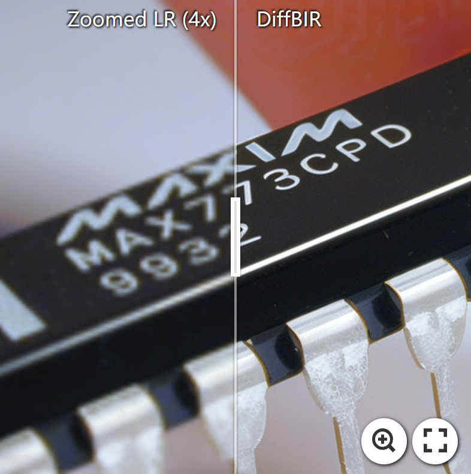
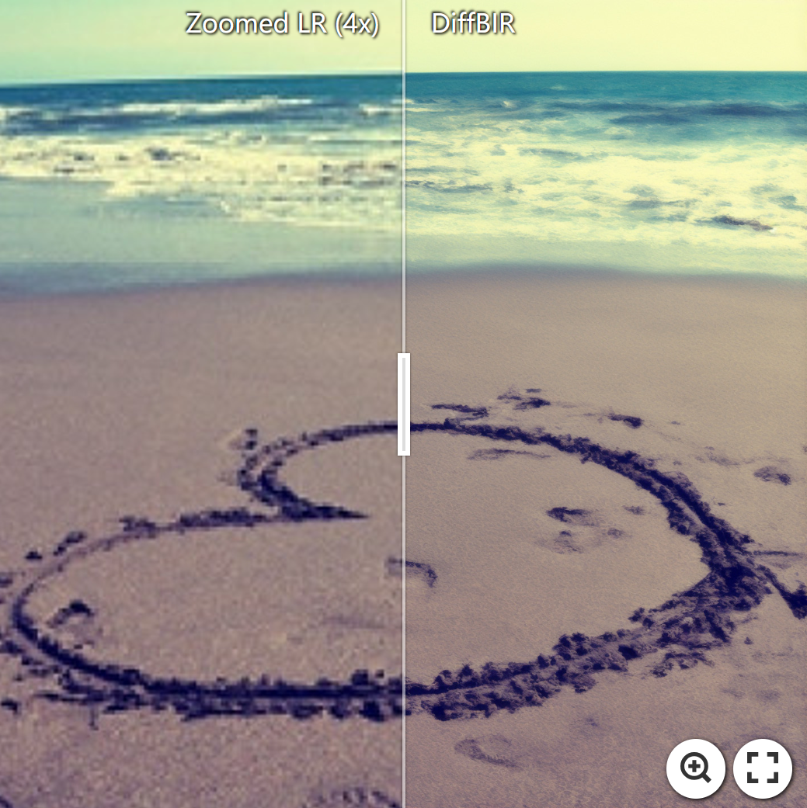
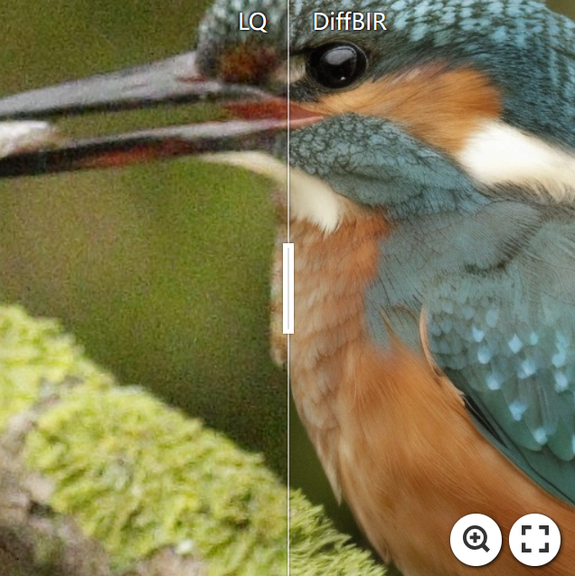
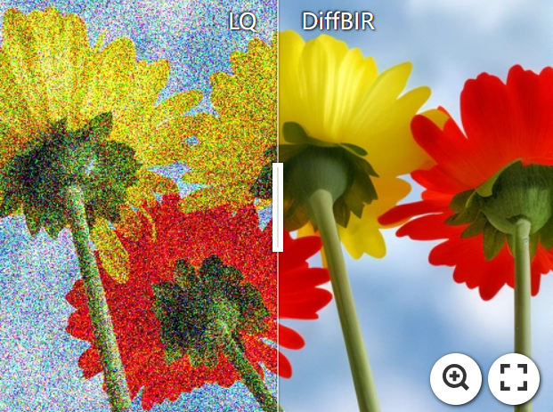
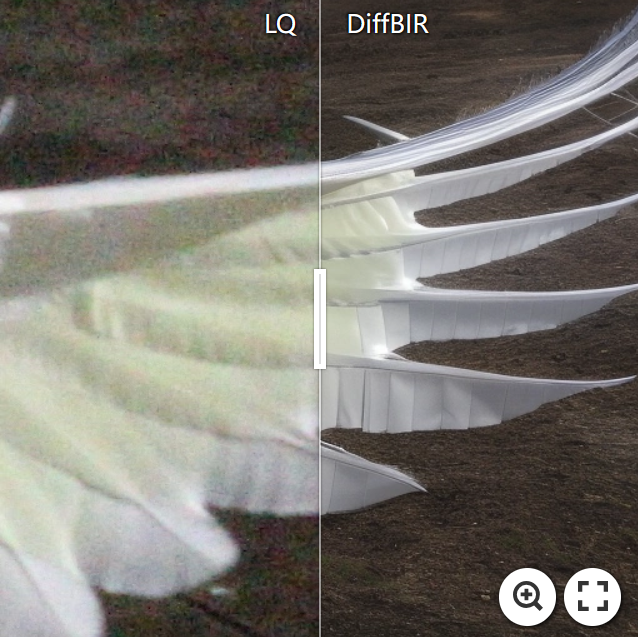
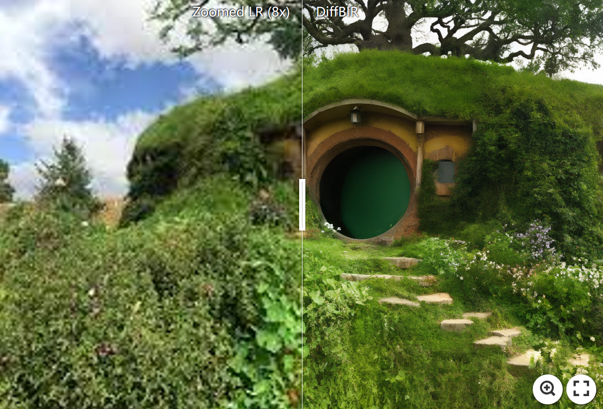

<!-- <p align="center">
    
</p> -->

## DiffIR2VR-Zero: Zero-Shot Video Restoration with Diffusion-based Image Restoration Models

<!-- [](https://arxiv.org/abs/2312.06640)  -->
[](https://jimmycv07.github.io/DiffIR2VR_web/) 
[](https://huggingface.co/spaces/Koi953215/DiffIR2VR)  

<!-- [Xinqi Lin](https://0x3f3f3f3fun.github.io/)<sup>1,\*</sup>, [Jingwen He](https://github.com/hejingwenhejingwen)<sup>2,3,\*</sup>, [Ziyan Chen](https://orcid.org/0000-0001-6277-5635)<sup>1</sup>, [Zhaoyang Lyu](https://scholar.google.com.tw/citations?user=gkXFhbwAAAAJ&hl=en)<sup>2</sup>, [Bo Dai](http://daibo.info/)<sup>2</sup>, [Fanghua Yu](https://github.com/Fanghua-Yu)<sup>1</sup>, [Wanli Ouyang](https://wlouyang.github.io/)<sup>2</sup>, [Yu Qiao](http://mmlab.siat.ac.cn/yuqiao)<sup>2</sup>, [Chao Dong](http://xpixel.group/2010/01/20/chaodong.html)<sup>1,2</sup>

<sup>1</sup>Shenzhen Institute of Advanced Technology, Chinese Academy of Sciences<br><sup>2</sup>Shanghai AI Laboratory<br><sup>3</sup>The Chinese University of Hong Kong -->

**DiffIR2VR-Zero** is a zero-shot video restoration method that uses pretrained image diffusion models to handle video restoration tasks such as denoising and up to 8x super-resolution.

<p align="center">
    
</p>

---
## Overview
<!--  -->

<p align="center">
    
</p>

<!-- :star:If DiffBIR is helpful for you, please help star this repo. Thanks!:hugs: -->

<!-- ## :book:Table Of Contents

- [Update](#update)
- [Visual Results On Real-world Images](#visual_results)
- [TODO](#todo)
- [Installation](#installation)
- [Pretrained Models](#pretrained_models)
- [Inference](#inference)
- [Train](#train) -->

<!-- ## <a name="update"></a>:new:Update

- **2024.04.08**: ✅ Release everything about our [updated manuscript](https://arxiv.org/abs/2308.15070), including (1) a **new model** trained on subset of laion2b-en and (2) a **more readable code base**, etc. DiffBIR is now a general restoration pipeline that could handle different blind image restoration tasks with a unified generation module.
- **2023.09.19**: ✅ Add support for Apple Silicon! Check [installation_xOS.md](assets/docs/installation_xOS.md) to work with **CPU/CUDA/MPS** device!
- **2023.09.14**: ✅ Integrate a patch-based sampling strategy ([mixture-of-diffusers](https://github.com/albarji/mixture-of-diffusers)). [**Try it!**](#patch-based-sampling) Here is an [example](https://imgsli.com/MjA2MDA1) with a resolution of 2396 x 1596. GPU memory usage will continue to be optimized in the future and we are looking forward to your pull requests!
- **2023.09.14**: ✅ Add support for background upsampler (DiffBIR/[RealESRGAN](https://github.com/xinntao/Real-ESRGAN)) in face enhancement! :rocket: [**Try it!**](#inference_fr)
- **2023.09.13**: :rocket: Provide online demo (DiffBIR-official) in [OpenXLab](https://openxlab.org.cn/apps/detail/linxinqi/DiffBIR-official), which integrates both general model and face model. Please have a try! [camenduru](https://github.com/camenduru) also implements an online demo, thanks for his work.:hugs:
- **2023.09.12**: ✅ Upload inference code of latent image guidance and release [real47](inputs/real47) testset.
- **2023.09.08**: ✅ Add support for restoring unaligned faces.
- **2023.09.06**: :rocket: Update [colab demo](https://colab.research.google.com/github/camenduru/DiffBIR-colab/blob/main/DiffBIR_colab.ipynb). Thanks to [camenduru](https://github.com/camenduru)!:hugs:
- **2023.08.30**: This repo is released. -->

<!-- ## <a name="visual_results"></a>:eyes:Visual Results On Real-world Images

### Blind Image Super-Resolution

[](https://imgsli.com/MTk5ODI3) [](https://imgsli.com/MTk5ODI4) [](https://imgsli.com/MTk5ODI1) -->


<!-- ### Blind Image Denoising

[](https://imgsli.com/MjUzNzkz) [](https://imgsli.com/MjUzNzky)
[](https://imgsli.com/MjUzNzkx)

### 8x Blind Super-Resolution With Patch-based Sampling


[](https://imgsli.com/MjUzODE4)
-->

<!-- ## <a name="todo"></a>:climbing:TODO

- [x] Release code and pretrained models :computer:.
- [x] Update links to paper and project page :link:.
- [x] Release real47 testset :minidisc:.
- [ ] Provide webui.
- [ ] Reduce the vram usage of DiffBIR :fire::fire::fire:.
- [ ] Provide HuggingFace demo :notebook:.
- [x] Add a patch-based sampling schedule :mag:.
- [x] Upload inference code of latent image guidance :page_facing_up:.
- [ ] Improve the performance :superhero:.
- [x] Support MPS acceleration for MacOS users.
- [ ] DiffBIR-turbo :fire::fire::fire:.
- [ ] Speed up inference, such as using fp16/bf16, torch.compile :fire::fire::fire:. -->

## <a name="installation"></a>Installation

```shell
# clone this repo
git clone https://github.com/jimmycv07/DiffIR2VR-Zero.git
cd DiffIR2VR-Zero

# create environment
conda create -n diffir2vr python=3.10
conda activate diffir2vr
pip install -r requirements.txt
```

## <a name="pretrained_weights"></a>Pretrained Weights

Please place the pretrained weights like the following folder structure. **You will need to download the [GMFlow](https://github.com/haofeixu/gmflow) weights manually; the rest will be downloaded automatically during inference.**

<!-- | Model Name | Description | HuggingFace | BaiduNetdisk | OpenXLab |
| :---------: | :----------: | :----------: | :----------: | :----------: |
| v2.pth | IRControlNet trained on filtered laion2b-en  | [download](https://huggingface.co/lxq007/DiffBIR-v2/resolve/main/v2.pth) | [download](https://pan.baidu.com/s/1uTAFl13xgGAzrnznAApyng?pwd=xiu3)<br>(pwd: xiu3) | [download](https://openxlab.org.cn/models/detail/linxinqi/DiffBIR/tree/main) |
| [GMFlow](https://github.com/haofeixu/gmflow) | IRControlNet trained on FFHQ | [download](https://huggingface.co/lxq007/DiffBIR-v2/resolve/main/v1_face.pth) | [download](https://pan.baidu.com/s/1kvM_SB1VbXjbipLxdzlI3Q?pwd=n7dx)<br>(pwd: n7dx) | [download](https://openxlab.org.cn/models/detail/linxinqi/DiffBIR/tree/main) |
-->

```
weights
└─── gmflow_sintel-0c07dcb3.pth
└─── v2.pth
└─── v2-1_512-ema-pruned.ckpt
```

<!-- ## <a name="quick_start"></a>:flight_departure:Quick Start

Download [general_full_v1.ckpt](https://huggingface.co/lxq007/DiffBIR/resolve/main/general_full_v1.ckpt) and [general_swinir_v1.ckpt](https://huggingface.co/lxq007/DiffBIR/resolve/main/general_swinir_v1.ckpt) to `weights/`, then run the following command to interact with the gradio website.

```shell
python gradio_diffbir.py \
--ckpt weights/general_full_v1.ckpt \
--config configs/model/cldm.yaml \
--reload_swinir \
--swinir_ckpt weights/general_swinir_v1.ckpt \
--device cuda
```

<div align="center">
    <kbd></img></kbd>
</div> -->

## <a name="inference"></a>Inference

We provide some examples of inference commands; for additional arguments, please refer to [inference.py](inference.py).


### Blind Video Denoising

```shell
python -u inference.py \
--version v2 \
--task dn \
--upscale 1 \
--cfg_scale 4.0 \
--batch_size 10 \
--input inputs/noise_50/flamingo \
--output results/Denoise/flamingo  \
--config configs/inference/my_cldm.yaml \
--final_size "(480, 854)" \
--merge_ratio "(0.6, 0)" \
--better_start 
```

### Blind Video Super-Resolution

```shell
python -u inference.py \
--version v2 \
--task sr \
--upscale 4 \
--cfg_scale 4.0 \
--batch_size 10 \
--input inputs/BDx4/rhino \
--output results/SR/rhino  \
--config configs/inference/my_cldm.yaml \
--final_size "(480, 854)" \
--merge_ratio "(0.6, 0)" 
```

## Citation

Please cite us if our work is useful for your research.

```
@article{yeh2024diffir2vr,
    title={DiffIR2VR-Zero: Zero-Shot Video Restoration with Diffusion-based Image Restoration Models},
    author={Chang-Han Yeh and Chin-Yang Lin and Zhixiang Wang and Chi-Wei Hsiao and Ting-Hsuan Chen and Yu-Lun Liu},
    journal={arXiv},
    year={2024}
}
```

<!-- ## License

This project is released under the [Apache 2.0 license](LICENSE). -->

## Acknowledgement

This project is based on [DiffBIR](https://github.com/XPixelGroup/DiffBIR) and [VidToMe](https://github.com/lixirui142/VidToMe). Thanks for their awesome work.

<!-- ## Contact

If you have any questions, please feel free to contact with me at linxinqi23@mails.ucas.ac.cn. -->
